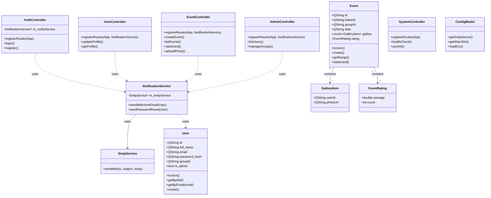

<!-- DOCTOC SKIP -->
# Class Diagrams

This document visualizes the class structure and relationships of the Cake Planner Backend.

## Overview

The application follows a defined **Model-View-Controller (MVC)** pattern (where "View" is JSON serialization).
- **Controllers** handle HTTP requests.
- **Services** encapsulate business logic and external communications (e.g., SMTP).
- **Models** represent data structures and contain database interaction logic.

## Class Diagram

