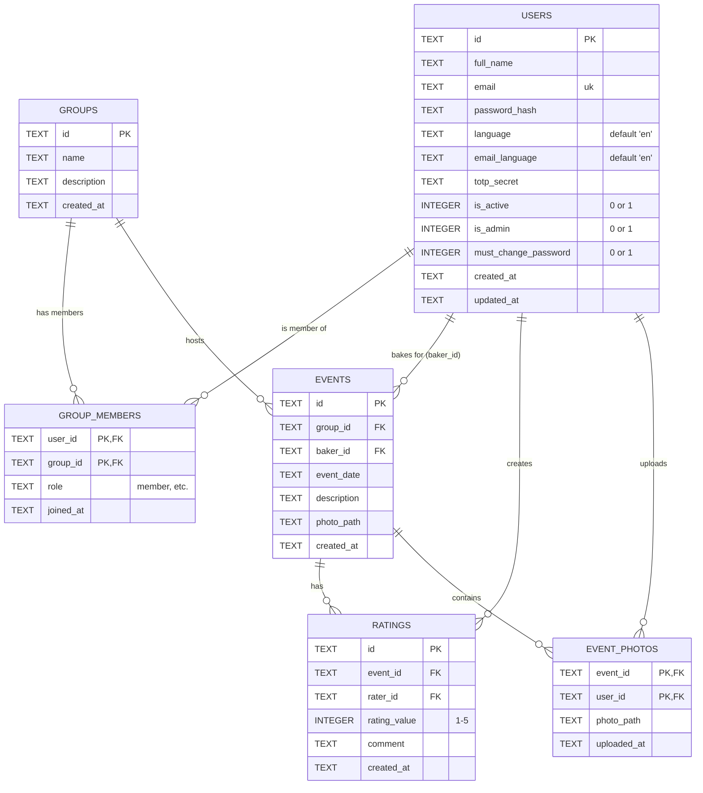

<!-- DOCTOC SKIP -->

# Database Schema

The Cake Planner Backend uses **SQLite** as its relational database. The database file is typically located at `data/cakeplanner.sqlite`.

## Entity-Relationship Diagram (ERD)

The following diagram shows the database tables and their relationships.

## Table Definitions

### `users`
Stores user account information.
- **Primary Key**: `id` (UUID as Text)
- **Unique**: `email`

### `groups`
Represents groups (e.g., departments, teams) that organize cake events.
- **Primary Key**: `id`

### `group_members`
Many-to-Many link between `users` and `groups`.
- **Composite Primary Key**: (`user_id`, `group_id`)
- **Foreign Keys**: Cascade delete on both user and group.

### `events`
Represents a cake bringing event on a specific date.
- **Primary Key**: `id`
- **Foreign Keys**:
  - `group_id`: The group this event belongs to.
  - `baker_id`: The user responsible for baking.

### `ratings`
Allows users to rate and comment on events.
- **Unique Constraint**: A user can only rate an event once (`event_id`, `rater_id`).
- **Check Constraint**: `rating_value` must be between 1 and 5.

### `event_photos`
Additional photos uploaded to an event gallery.
- **Composite Primary Key**: (`event_id`, `user_id`) - *Note: Schema implies one photo per user per event based on PK, or just efficient linking.*

## Migration System

Database migrations are handled automatically in `DatabaseManager::migrate()`.
- On startup, the application checks if tables exist.
- If not, it executes `CREATE TABLE IF NOT EXISTS` statements.
- Uses `PRAGMA foreign_keys = ON` to enforce integrity.
